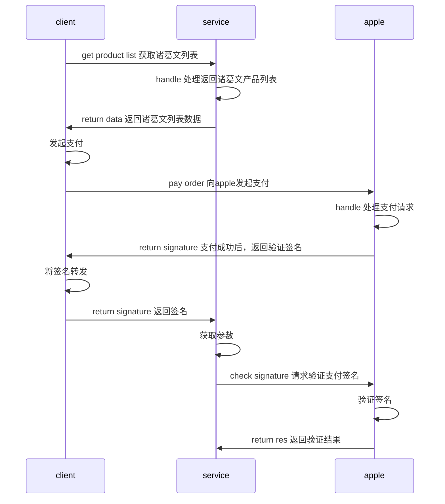

# ios内购支付
## 项目背景
> 因苹果平台发布的app内上架虚拟商品必须经过苹果支付平台体系，固需要设计苹果ios平台支付

## 业务逻辑流程

```mermaid
sequenceDiagram
client->>service: get product list 获取诸葛文列表
service->>service: handle 处理返回诸葛文产品列表
service->>client: return data 返回诸葛文列表数据
client->>client: 发起支付
client->>apple: pay order 向apple发起支付
apple->>apple: handle 处理支付请求
apple->>client: return signature 支付成功后，返回验证签名
client->>client: 将签名转发
client->>service: return signature 返回签名
service->>service: 获取参数
service->>apple: check signature 请求验证支付签名
apple->>apple: 验证签名
apple->>service: return res 返回验证结果
```
