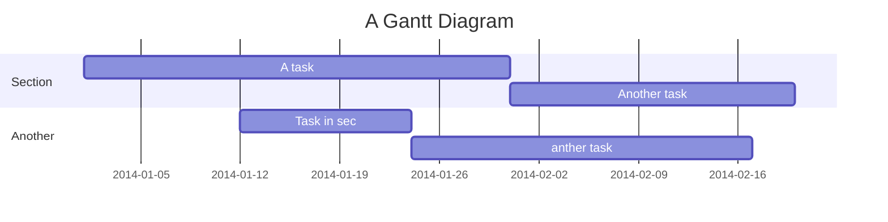

# MarkDown Demo
[TOC]
## 美人鱼图

### 甘特图




### 语法


	------------------------------
	```mermaid
	gantt
	title A Gantt Diagram
	
	section Section
	A task           :a1, 2014-01-01, 30d
	Another task     :after a1  , 20d
	section Another
	Task in sec      :2014-01-12  , 12d
	anther task      : 24d
	```
	------------------------------
	有的编辑器使用以下语法
	```sequence
	    Alice->John: Hello John, how are you?
	    loop every minute
	        John-->Alice: Great!
	    end
	```
	------------------------------
	
	graph TD
	    A[Christmas] -->|Get money| B(Go shopping)
	    B --> C{Let me think}
	    C -->|One| D[Laptop]
	    C -->|Two| E[iPhone]
	    C -->|Three| F[Car]
	
	------------------------------


## MathJax数学公式

$$\sqrt[3]{9} = 3$$ 

$$\sqrt{2} \quad and \quad \sqrt[n]{3}$$


$$
f(x_1,x_2,\underbrace{\ldots}_{\rm ldots} ,x_n) = x_1^2 + x_2^2 + \underbrace{\cdots}_{\rm cdots} + x_n^2
$$


$$
\left\{
\begin{array}{c}
a_1x+b_1y+c_1z=d_1 \\ 
a_2x+b_2y+c_2z=d_2 \\ 
a_3x+b_3y+c_3z=d_3
\end{array}
\right. 
$$


$$\overbrace{a+\underbrace{b+c}_{1.0}+d}^{2.0}$$


$$\fbox{a+b+c+d}$$


## html
### html嵌套

<pre><code>
```java
asdasdas
```
</code></pre>

### html转义符
<pre><code>
&#123;% mermaid %&#125;
	graph TD
	    A[Christmas] -->|Get money| B(Go shopping)
	    B --> C&#123;Let me think&#125;
	    C -->|One| D[Laptop]
	    C -->|Two| E[iPhone]
	    C -->|Three| F[Car]
&#123;% endmermaid %&#125;
&lt;pre class=&quot;mermaid&quot;&gt;
</code></pre>

## 引用
- [mermaid](https://github.com/mermaid-js/mermaid)
- [数学公式](https://www.zybuluo.com/codeep/note/163962)
- [KATEX](https://katex.org/)