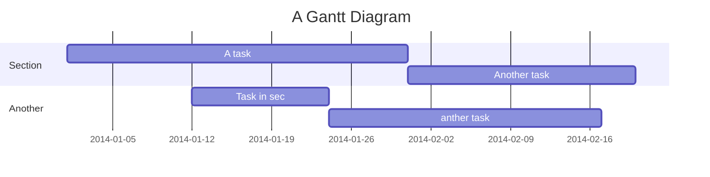

# MarkDown Demo

## 美人鱼图

## MathJax数学公式

$$\sqrt{2} \quad and \quad \sqrt[n]{3}$$

$$f(x_1,x_2,\underbrace{\ldots}_{\rm ldots} ,x_n) = x_1^2 + x_2^2 + \underbrace{\cdots}_{\rm cdots} + x_n^2$$

$$
\left\{
\begin{array}{c}
a_1x+b_1y+c_1z=d_1 \\ 
a_2x+b_2y+c_2z=d_2 \\ 
a_3x+b_3y+c_3z=d_3
\end{array}
\right. 
$$