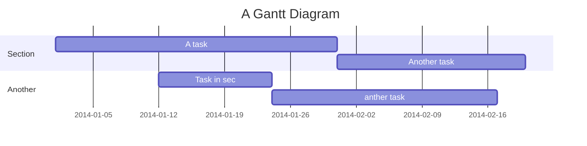
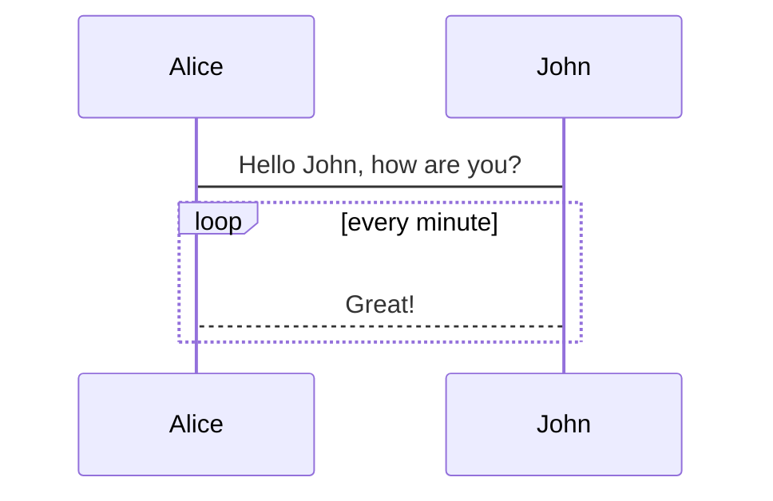

# MarkDown Demo
[TOC]
## 美人鱼图

### 甘特图



### 时序图



### 语法


	------------------------------
	```mermaid
	gantt
	title A Gantt Diagram
	
	section Section
	A task           :a1, 2014-01-01, 30d
	Another task     :after a1  , 20d
	section Another
	Task in sec      :2014-01-12  , 12d
	anther task      : 24d
	```
	------------------------------
	有的编辑器使用以下语法
	```sequence
	    Alice->John: Hello John, how are you?
	    loop every minute
	        John-->Alice: Great!
	    end
	```
	
	
	graph TD
	    A[Christmas] -->|Get money| B(Go shopping)
	    B --> C{Let me think}
	    C -->|One| D[Laptop]
	    C -->|Two| E[iPhone]
	    C -->|Three| F[Car]
	
	------------------------------


## 数学公式
### MathJax数学公式

$$\sqrt[3]{9} = 3$$ 

$$\sqrt{2} \quad and \quad \sqrt[n]{3}$$


$$
f(x_1,x_2,\underbrace{\ldots}_{\rm ldots} ,x_n) = x_1^2 + x_2^2 + \underbrace{\cdots}_{\rm cdots} + x_n^2
$$


$$
\left\{
\begin{array}{c}
a_1x+b_1y+c_1z=d_1 \\ 
a_2x+b_2y+c_2z=d_2 \\ 
a_3x+b_3y+c_3z=d_3
\end{array}
\right. 
$$


$$\overbrace{a+\underbrace{b+c}_{1.0}+d}^{2.0}$$


$$\fbox{a+b+c+d}$$

$$\vec{a} \cdot \vec{b}=0$$


$$
\begin{array}{cc}
\mathrm{Bad} & \mathrm{Better} \\
\hline \\
\iiint_V f(x){\rm d}z {\rm d}y {\rm d}x & \iiint_V f(x)\,{\rm d}z\,{\rm d}y\,{\rm d}x
\end{array}
$$

$$
\begin{array}{cc}
\mathrm{Bad} & \mathrm{Better} \\
\hline \\
\int\int_S f(x)\,dy\,dx & \iint_S f(x)\,dy\,dx \\
\int\int\int_V f(x)\,dz\,dy\,dx & \iiint_V f(x)\,dz\,dy\,dx
\end{array}
$$

$$\require{AMScd}$
\begin{CD}
    A @>a>> B\\
    @V b V V\# @VV c V\\
    C @>>d> D
\end{CD}$$

$$
x = a_0 + \frac{1^2}{a_1+}
          \frac{2^2}{a_2+}
          \frac{3^2}{a_3 +} \frac{4^4}{a_4 +} \cdots
$$

$$\int_{0}^{1}f(x)dx \sum_{1}^{2}\int_{0}^{1}f(x)dx \sum_{1}^{2}\int_{0}^{1}f(x)dx \sum_{1}^{2}\int_{0}^{1}f(x)dx \sum_{1}^{2}\int_{0}^{1}f(x)dx \sum_{1}^{2}\int_{0}^{1}f(x)dx \sum_{1}^{2}\int_{0}^{1}f(x)dx \sum_{1}^{2}\int_{0}^{1}f(x)dx \sum_{1}^{2}\int_{0}^{1}f(x)dx \sum_{1}^{2}\int_{0}^{1}f(x)dx \sum_{1}^{2}$$


### LaTex

$$ c = \sqrt{a^{2}+b_{xy}^{2} +e^{x}} $$

$$E = mc^2 $$

$$ \boxed{E=mc^2} $$

$$\left(iD\!\!\!/+m\right)\psi = 0$$

$$\dfrac{1}{2}$$

## html
### html嵌套

<pre><code>
```java
asdasdas
```
</code></pre>

### html转义符
<pre><code>
&#123;% mermaid %&#125;
	graph TD
	    A[Christmas] -->|Get money| B(Go shopping)
	    B --> C&#123;Let me think&#125;
	    C -->|One| D[Laptop]
	    C -->|Two| E[iPhone]
	    C -->|Three| F[Car]
&#123;% endmermaid %&#125;
&lt;pre class=&quot;mermaid&quot;&gt;
</code></pre>

## 引用
- [mermaid](https://github.com/mermaid-js/mermaid)
- [数学公式](https://www.zybuluo.com/codeep/note/163962)
- [KATEX](https://katex.org/)
- [flowchart.js](http://flowchart.js.org/)